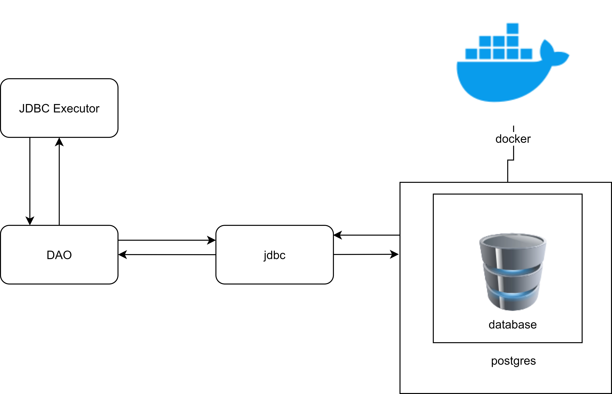
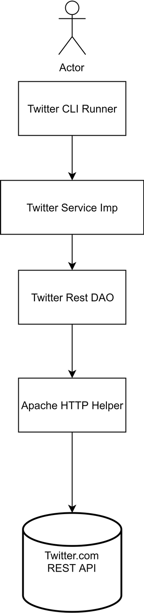

# Introduction

This repository have three java apps in three sub packages. Which are java grep app, JDBC app and Twitter CLI app. Understanding and knowledge of previous apps is required for completion in linear order. 

## Java Grep app

This application scans files in provided directory and all sub directories and matches provided argument line by line for writing matched lines in output file.

### Usage

Three arguments are provided to the application.

1. pattern for matching
2. An absolute path to directory of operation
3. An output file in the following swquence  
`regex_pattern absolute_path output_file`  
      as an exmaple  
    `.*data.* /home/usr/centos/Downloads/ /tmp/grep.out`  
   will search word data in files of Downloads and its subdirectories files and writes the matching lines to grep.out file.

### Design and Implementation
In this application we have two scripts **JavaGrep** and **JavaGrepImp**
* JavaGrep is an interface which is used to write abstraction of methods used in the app.

* JavaGrepImp is the only class written for this app .First the main method is called  in which arguments are set into JavaGrepImp's instance. Then files are processed using process method which calls other defined methods and final results are written if any to ouput file.

  ### Enhancements and Issues

  1. app use alot of memory by saving all the files in memory. It will be huge improvement if the  app do  read and match simultaneously and only use memory to store the matched lines.
  2. All files for provided directories and subdirectories are scanned Improvements can be made by adding  file format escape filter and directory exclusion filter.
  3. Support for multiple regex filters can be added to improve the usability considerably.
  4. A feature can be added where all the matched lines from one file can be separated from the matched lines of next file using line breaks and  content of every subdirectory double line spaces or otherwise in a directory and file tree structure.

  ## JDBC App

  Java DataBase Connectivity  app is designed to simulate a java connectivity to Relational database management system. It is Implemented using CRUD (Create,Read,Update,Delete) methodology using DAO's , DTO's and SQL's DDL,DML,DCL and TCL.
  
  add picure in it

  ### Usage
this app is used to connect to RDBMS from java. The database 
hplussport consists of five tables 
  * customer table which stores following values
    * unique id
    *first name
    * last name
    * email address
    * phone number
    * address
    * city
    * state
    * zipcode
  * salesperson table
    * id
    * first name
    * last name
    * email
    * phone
    * address
    * city
    * state
    *zipcode
  * product
    * product id
    * product code
    * product name
    * product size
    * product variety
    * product price
    * product status
  * orders table have following values
    * order id
    * order creation date
    * amount due
    * order status
    * customer id
    * salesperson id
  * order_item  table stores
    * order id
    * product id
    * quantity ordered
    * and a unique id

  ### Design and Implementation

  This Project is implemented with client server architecture.
  JDBC executor recieves the user input intializes the layers
   and execute the program.
  A database is created in postgresql which runs in a docker container.
  Data access object execute the sql queries and saves the results
   and perform CRUD operations using customerDAO and OrderDAO . 

  ### Enhancements and Issues

  1. app can be improved by asking for user requests
   instead of manually executing sql queries.

  ### Libraries

  1. signpost commonHttp4

  2. JUnit

  3. Jakson databined

  4. Spring-Boot-Starter-Web

  5. Commons-Dbcp2

  6. Postgresql

  7. Spring-boot-maven-plugin

     

  ## Twitter CLI App

  This java application makes user capable of basic twitter
   features including SHOW,DELETE and POST tweets through command 
   line. A twitter developer account is required for this purpose.

  ### Developer Account and Initial Setup

  To obtain a developer twitter account a working phone number along
   with regular user twiter account is required. It usually take about 
   a day for application process to complete for twitter developer account.

  After account is created and authorized four value are copied to local
   machine and made as environment variables these values are

  1. consumerKey

  2. consumerSecret

  3. accessToken

  4. tokenSecret

     These are secret values and should not be shared publicly on
      any platform. If by mistake these values get added on GitHub
       in a public repository, might result in GitHub account temporary suspension. 

     ### Usage

  `post "twitter content"  "coordinate as lattitude:longituted"`
  
  `delete  "tweet-id,tweet-id" you can give multiple tweet id`
  
  `show  "tweet-id"`
  
  have to add more content into it

  

  

  

  ### Design and Implementation

  This app is implemented in several layers and rolled up in packages.
  The main package layer is with class TwitterCLIApp.It contains main method
  and all dependencies are created here and user/actor input is passed to
  TwitterServiceImp.In TwitterService user input is validated  and sent
  to twitterRestDAO only if passes the criteria.TwitterRestDao implements the 
  CrdDao interface and depends on the HttpHelper, which is responsible of creating 
  URI to POST,SHOW or DELETE a tweet. Apache HTTP Helper handles the access to 
  TwitterRestAPi.Twitter Authentication details are stored in system environment
  variables and get accessed from there.
  

  

  

  

  

  ### Test

  

  

  

  ### Spring Framework

  
its a very power ful tool for java

### Spring boot
this is also very power full methodology to write code in java.
  

  

  

  

  ### Enhancements and Issues

  1. Hashtag searching can be added
  2. support for links images and videos upload can be added
  3. A prompt for user can be added if access tokens are not formatted or invalid.

